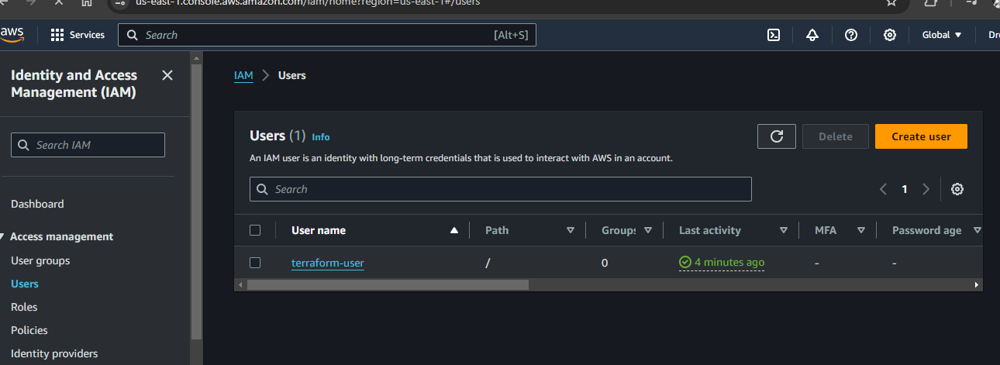
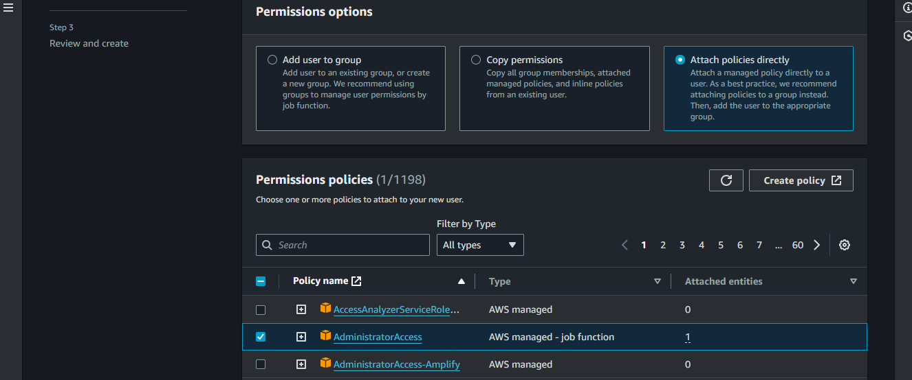
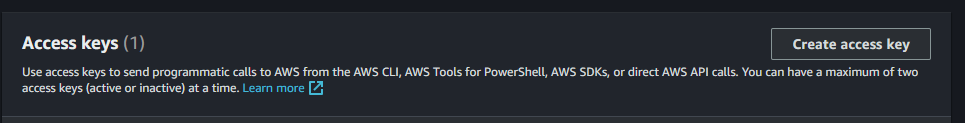

# Creating an IAM User and Assigning Permissions in AWS

## Introduction

In AWS (Amazon Web Services), IAM (Identity and Access Management) allows you to manage access to AWS services and resources securely. This guide will walk you through the process of creating an IAM user, assigning permissions, and generating access keys. These steps are essential for granting users the necessary permissions to interact with AWS services programmatically.

## Prerequisites

Before you begin, ensure you have the following:

- An AWS account with administrative access or sufficient permissions to create IAM users and manage policies.
- Access to the AWS Management Console.
- The AWS Toolkit extension installed in Visual Studio Code (optional but recommended for development and deployment tasks).

## Steps

### 1. Sign in to the AWS Management Console

Navigate to the [AWS Management Console](https://aws.amazon.com/console/) and sign in using your AWS account credentials.

### 2. Access the IAM Dashboard

Click on the "Services" dropdown menu at the top left corner of the console, then select "IAM" under the "Security, Identity, & Compliance" category.

### 3. Create a New IAM User

- In the IAM dashboard, click on "Users" in the left navigation pane.
- Click on the "Add user" button to create a new IAM user.

*Image: Create IAM User*

- Enter a username for the new IAM user and select the access type Programmatic access.
- Optionally, you can add the user to an existing group or attach policies directly to the user.

### 4. Set Permissions for the IAM User

- After creating the IAM user, you can assign permissions by attaching policies.
- Click on the newly created user's name to view user details.
- In the "Permissions" tab, click on "Add permissions" to attach policies.

*Image: Attach Policies*

- Choose from existing policies or create custom policies to define the permissions for the IAM user.
- Review the permissions and click "Next: Review" to proceed.

### 5. Review and Create the IAM User

- Review the user details and permissions.
- Click "Create user" to finalize the creation of the IAM user.

### 6. Generate Access Key for the IAM User

- Once the IAM user is created, you can generate access keys for programmatic access.
- In the IAM dashboard, select the newly created user.
- Go to the "Security credentials" tab and click on "Create access key".

*Image: Create Access Key*

- Make note of the access key ID and secret access key, as they are required for programmatic access to AWS services.

## Conclusion

By following these steps, you can create an IAM user, assign permissions, and generate access keys in AWS. This allows users to interact with AWS services programmatically, either through API calls or using the AWS Toolkit extension in Visual Studio Code. Properly managing IAM users and permissions is essential for maintaining security and compliance in your AWS environment.
